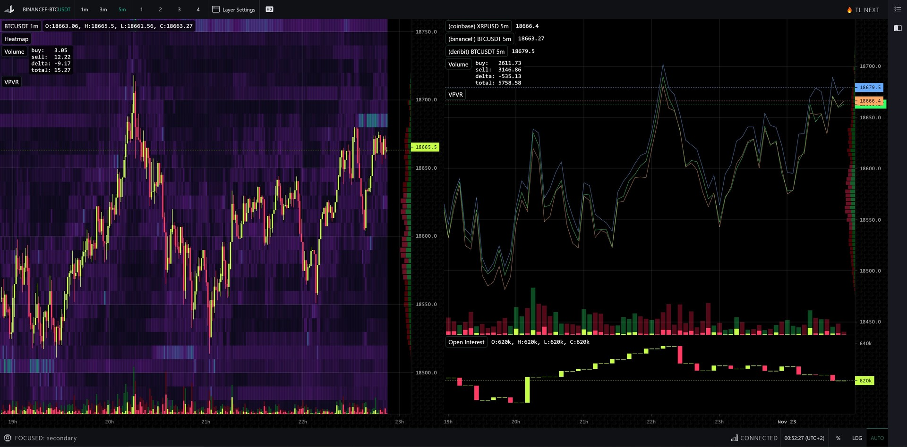

<small>[Click here](#changelog) to skip directly to changelog</small>

## Website changes

This is a long awaited update, at least for us, that we've wanted to do for quite some time but we were too busy working on the app itself.

Previous website was incompatible with older browsers, took a while to load and wasn't really search engine friendly (e.g. in case you wanted to find our content from Google). We've reworked it to bring improved browser support, fixed various user experience issues and made it easier for us to maintain in the future.

## TradingLite Manual

One of the most interesting work-in-progress pages is the **TradingLite Manual**, no, not for LitScript, but for the actual app itself.

We're currently looking for a contributor to help us create a nice guide on how to use TradingLite and its features, reach us out on [Discord](/discord) if you think you're that person. We will be offering a whole yearly plan if you think you can help us.

## Progress report 

We usually share our internal progress on our #lucky-channel on Discord (only visible if you have the lucky status 🍀), but sometimes things are a bit too exciting to not share them with the world.

Here in the following screenshot you can see our work-in-progress new API with the latest platform we've been developing.

<small class="caption">Fast load of HD heatmap, also no view reset</small>

<small class="caption">Multiple exchanges on one chart and multiple charts support</small>

## Additional servers

We've also been conducting tests with additional servers closer to Asia. We'll write a dedicated post on this in the future.

---

### Changelog

#### New stuff

> - Added **Binance Futures**: `AAVE`, `OCEAN`
> - Added **FTX**: `TRUMPFEB`

> - Website: Rebuilt from scratch, faster loading time, works on most outdated browsers
> - Website: Social media preview of TradingLite links now work
> - Website: Password fields now got this handy show/hide button

#### Improvements

> - [Connected Devices](/account/security) will re-use existing access and no longer generate any duplicates

> - Upgrade page: Improved errors display when something isn't working
> - Website: LitScript [Manual](/docs/litscript) and [Reference](/docs/reference) UX improved
> - Website: Homepage screenshots can be zoomed in on desktop and mobile
> - Website: A lot of minor UX changes that feel so natural that you'll barely notice they're there

> - Adjusted heatmap settings for a number of pairs on Binance Futures, Bitfinex, Bitstamp, Coinbase and FTX
> - Adjusted heatmap filters on Bitstamp to detect smaller orders

#### Fixes

> - Deactivated `BIDEN` and `TRUMP` pairs from **FTX**
> - Fixed Discord links in [Help Center](/support)
> - Fixed a bug where trial users could not use certain indicators
> - LitScript: Major fix to accuracy for `ask_sum_all`, `bid_sum_all`, `ask_sum`, `bid_sum`, `ask_sum_range`, `bid_sum_range`, `ask_highest`, `bid_highest`, `ask_spread`, `bid_spread` functions.

---

### Changelog (11/07/2020)

#### New stuff

> - New [Billing Portal](/account) where you can change your Credit Card details, download invoices and see your payment status

