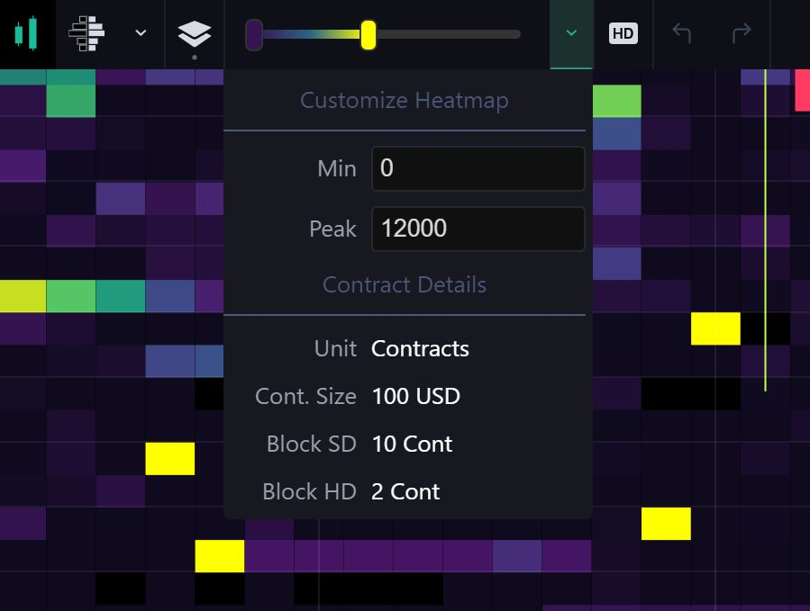

Happy Holidays!

<small>[Click here](#changelog) to skip directly to changelog</small>

## Additional servers

In order to provide the greatest coverage with reduced latency to all of our users, we deployed additional servers.

- [us.tradinglite.com](https://us.tradinglite.com) - United States (East Coast)
- [sg.tradinglite.com](https://sg.tradinglite.com) - Singapore
- [jp.tradinglite.com](https://jp.tradinglite.com) - Japan
- [kr.tradinglite.com](https://kr.tradinglite.com) - South Korea
- [tradinglite.com](https://tradinglite.com) - Europe

This is part of our ongoing efforts to improve overall experience when using TradingLite.
In the future, the server selection will be completely automatic, but for now please use the subdomains.

_Let us know if you experience any issues with the new servers!_

## Instrument Information Dropdown

This dropdown will show you some basic information such as the block size on the heatmap ( for SD and HD ) and the units used.

We had to manually set the units and contract sizes for every single pair of each exchange.

_If you see any mistakes, please let us know so we can correct them as soon as possible._

## New Pairs

The following pairs will be enabled **next week** 🥳

#### Binance

> - `AAVE-USDT` & `AAVE-BTC`
> - `DOT-USDT` & `DOT-BTC`
> - `EGLD-USDT` & `EGLD-BTC`
> - `FIL-USDT` & `FIL-BTC`
> - `GRT-USDT` & `GRT-BTC`
> - `OCEAN-USDT` & `OCEAN-BTC`
> - `SXP-USDT` & `SXP-BTC`
> - `YFI-USDT` & `YFI-BTC`

#### Binance Futures

> - `EGLD-USDT`
> - `FIL-USDT`
> - `GRT-USDT`

#### FTX

> - `AAVE-PERP`
> - `COMP-PERP`
> - `SOL-PERP`
> - `SUSHI-PERP`
> - `THETA-PERP`
> - `UNI-PERP`
> - `YFI-PERP`

---

### Changelog

#### New stuff

> - [New servers](#additional-servers): `United States`, `Singapore`, `Korea` and `Japan`

> - Added new **Binance Futures** pairs
> - Added new **Binance** pairs
> - Added new **FTX** pairs

> - [New dropdown menu](#instrument-information-dropdown) showing a few key details about the current instrument

> - New authentication method for the upcoming API (not yet released)
> - We're currently experimenting with adding a live chat on our website, so we might enable this at some point

#### Improvements

> - Greatly improved the email deliverability to all users, no more emails sent to junk/spam!
> - Added decimal places to small numbers on the footprint (e.g. show 8.1 instead of 8)
> - Made Value Area on VPVR slightly more visible

> - UX improvements for exchange/pair selection menu

#### Fixes

> - Fixed a rare bug on VPVR and VPVR+
> - Disable checks that would cause infinite redirect loops
> - Rare bug with password checks
> - Fixed few website link issues
> - Shortcuts getting stuck when toggling between candle and footprint modes

