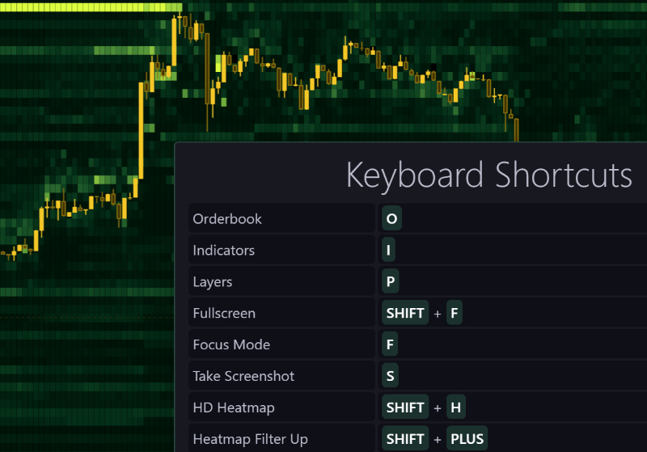

### Customize theme and Heatmap colors
You can personalize heatmap colors and theme to fit your visualization style.

### Free Form Zoom ( Right-click )
By right clicking and dragging your mouse on the chart, you can zoom-in and zoom-out in any direction.

### Heatmap Extend
Last slice of heatmap is repeated so that you can see the latest real-time changes clearly without zooming in or having candles blocking your view.

### Hollow Candles
Sometimes candle body can block your view and makes it harder to see the heatmap, hollow candles only draw the outline allowing you to see through them.

### Quick Layer Visibility menu
Show and hide individual layers and plots quickly using this menu.

### Move VPVR to left
You can personalize position and width of VPVR through its settings.

### Orderbook
Orderbook panel has various settings and can be resized.

### Trades
Trades panel has various settings and can be resized.

### Keyboard Shortcuts
A full list of all Keyboard shortcuts can be seen by pressing **&#39;k&#39;** on your keyboard when viewing your chart.

